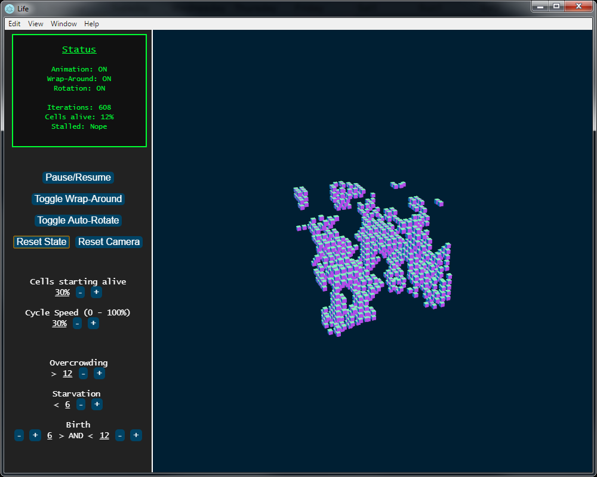

# Life - Conway's Game of Life in 3 Dimensions

<i>4,000 3D cells playing The Game of Life in the desktop version</i>

*See below for details of original version - "Conway's Game of Life".*

-------------------

## 3-Dimensional Implementation

Implementing the game of life in 3 dimensions requires adjusting the rules to account for the increase in neighbors. It's hard to find what specific values could lead to a cellular automata comparable to that in the 2D version of the game, so I initialize the program with values proportional to the 2D values.

This implementation is written in JavaScript, with features from ES5 and ES6, using the Three.js graphics library and is available as a desktop application thanks to the Electron.js library. 

<i>Three of the first few states from one instance.</i>

### Running The Application

*Running the program as a desktop application rather than a webpage allows for much better performance.*

1. Install Electron.js - `npm install -g electron`
2. Clone this repository.
3. Choose to run the app as a desktop or web application
  - To run as a desktop application
    - From inside your cloned directory, run `electron .`
  - To run as a webpage
    - Open the `index.html` file with Google Chrome or Mozilla Firefox
    
### Features

- Available as a desktop application on any OS
- Available as a web application
- Fast 3D graphics with Three.js
- Camera is controllable with mouse
- Simple, easy to use interface
- Auto-rotation to show entire scene
- Status menu shows number of iterations and percentage of cells alive
- Reset and restart the game with the click of a button
- Adjustable
  - While running the program these variables are adjustable in real-time:
    - Percentage of cells to initialize in the alive state
    - 'Wrap-around' on or off; allows for infinite-size world simulation
    - 'Auto-rotate' on or off
    - Speed at which the world iterates to the next state
    - All of the rules of the game: overcrowding, starvation, and the birth-range
- Customizable - safe-to-change variables in `app.js` under `settings`
  - Size of and spacing between cells
  - Number of cells along each row/column/layer
  - Speed of auto-rotation
  
  
  
-------------------

## Conway's Game of Life (Original, 2-dimensional version)

From the Conway's Game of Life [Wikipedia entry](https://en.wikipedia.org/wiki/Conway%27s_Game_of_Life).

> The Game of Life, also known simply as Life, is a cellular automaton devised by the British mathematician John Horton Conway in 1970.[1]

> The "game" is a zero-player game, meaning that its evolution is determined by its initial state, requiring no further input. One interacts with the Game of Life by creating an initial configuration and observing how it evolves, or, for advanced "players", by creating patterns with particular properties.

### Rules

> The universe of the Game of Life is an infinite two-dimensional orthogonal grid of square cells, each of which is in one of two possible states, alive or dead, or "populated" or "unpopulated" (the difference may seem minor, except when viewing it as an early model of human/urban behavior simulation or how one views a blank space on a grid). Every cell interacts with its eight neighbours, which are the cells that are horizontally, vertically, or diagonally adjacent. At each step in time, the following transitions occur:

> - Any live cell with fewer than two live neighbours dies, as if caused by under-population.
> - Any live cell with two or three live neighbours lives on to the next generation.
> - Any live cell with more than three live neighbours dies, as if by over-population.
> - Any dead cell with exactly three live neighbours becomes a live cell, as if by reproduction.

> The initial pattern constitutes the seed of the system. The first generation is created by applying the above rules simultaneously to every cell in the seed—births and deaths occur simultaneously, and the discrete moment at which this happens is sometimes called a tick (in other words, each generation is a pure function of the preceding one). The rules continue to be applied repeatedly to create further generations.
